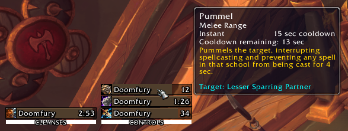

<h1>GroupCooldowns</h1>
WoW Client Version: 7.3.5 (Legion)

Shows the cooldown of controls (interrupt, stun, cc) and cleanses (dispell, util buff) of the group.

Setup in <code>Interface > Addons > GroupCooldowns)</code>

Author: raul1ro (discord)

If you have any suggestion, found a bug or need help, feel free to type to me in discord or create an issue on Github.

